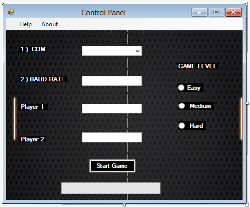

# Pinpon Game with C# Interface and Arduino

## About the Project
This project was prepared as the final assignment of "EEES 403 - Programming Languages" course during my bachelor in Çukurova University.

The Pinpon game was created in interactive way by using Arduino development board. The rackets are controlled with Arduino and also 6 LEDs show the score of each player. In this way, winning player is shown by blinking the LEDs.

## Project Detail

Two forms were designed because the whole second form is used as the game screen. The first form is responsible for the necessary settings to start the game. The connection settings between Arduino and C# are configured in here. Arduino communicate with C# forms via USB ports. So the suitable port is selected and necessary Baud Rate is set in the 1st form. Also the players information and gema settings are forward to the 2nd form.

  

Arduino sends the values that are read from the potentiometers to the 2nd form. Their position data is used to control the rackets in the game.

_"edge_control"_ function keeps the ball inside the form area and _"score_event"_ function checks the position between rackets and  balls. In this way program decides the score of each player. 

Also the score data is written in "Serial Port" and Arduino read back this information and it turns the LEDS on or off according to the scores of the players.

  
